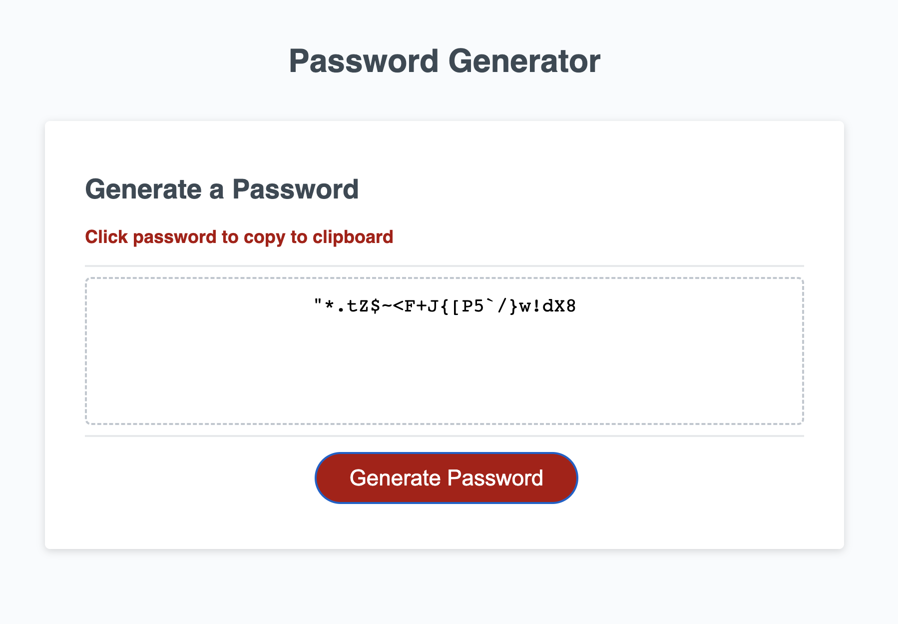

# Password Generator App

## Description

An application that enables employees to generate random passwords based on criteria that they’ve selected. This web app features dynamically updated HTML and CSS powered by JavaScript code.

Try the app here: [shanelbeebe.github.io/password-generator](https://shanelbb.github.io/password-generator/)

## Features & Functionality

- User chosen length between 8 & 128 characters
- User chosen criteria from lowercase, uppercase, numbers, special characters
- Error handling if user chooses non-numerical characters, numbers outside of 8-128 or if they don't choose any criteria
- Click generated password to copy it to clipboard

The following image shows the web application's appearance and functionality:

## Challenges and Learning Opportunities  

**Error handling**  
 
    - Used recursion to get the generatePassword function to restart when certain conditions weren't met. However, I had trouble figuring out how to prevent the first function call from continuing to run. I realized that using a return on the recursive function call was the solution.  
    - Capturing all the conditions where user input something other than a number between 8 & 128. I learned about the unary plus operator which turns user input into a number. I was able to use isNan to reject any non-numeric characters.

**Click to copy**  

    - Learned about the JavaScript Clipboard API  
    - Was able to create a function where user can click the password text to copy it to their clipboard
